# Koyomi（こよみアラーム）

日本の祝日を避けて鳴る、Windows デスクトップ向けの目覚ましアプリです。

暦（こよみ）で鳴る日を決めるのが、このアプリの芯です。
「平日だけ、ただし祝日は鳴らさない」「出張の日は飛ばす」といった条件を
そのまま設定でき、止め方も計算問題や順番タップから選べます。

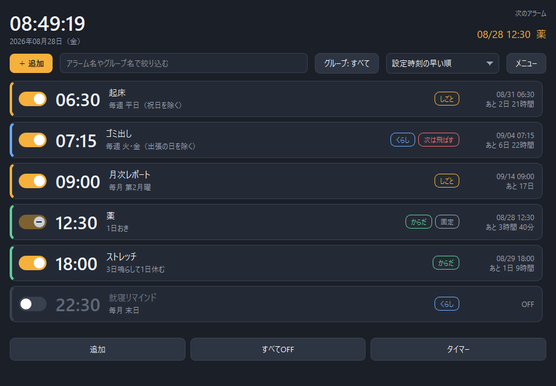

[](https://www.python.org/)
[](https://doc.qt.io/qtforpython/)
[](LICENSE)

---

## はじめかた

```bash
python -m pip install -r requirements.txt
```

```bash
pythonw run.pyw
```

`run.pyw` はコンソールを出さずに始める入口です。

デスクトップやスタートメニューから開きたいときは、次の道具でショートカットを作ってください。
いま使っている Python を名指しした `.lnk` を、アイコン付きで置きます。

```bash
python tools/make_shortcut.py
```

| つけるもの | はたらき |
| --- | --- |
| `--start-menu` | スタートメニューにも置く |
| `--minimized` | トレイに畳んだ状態で始める |
| `--where` | 作らずに、置き場所だけ出す |

`run.pyw` を直接ダブルクリックしても開きますが、拡張子 `.pyw` の関連付けが Microsoft Store の Python など
別の Python に取られている場合は、部品の入っていない Python で開こうとして失敗します。
ショートカットなら Python を名指しできるので、その心配がありません。

動きがおかしいときは、コンソール付きの入口から始めるとその場で内容を確認できます。

```bash
python run.py
```

コンソールを出さずに始めたときは、つまずいた記録だけが `%APPDATA%\Koyomi\error.log` に残ります。
何事も無ければこのファイルはできません。

初回起動時に、内蔵アラーム音（6 種）とアイコン類をその場で合成して
`%APPDATA%\Koyomi\` の下へ書き出します。音源や画像の同梱はありません。

動作確認は Windows 11 / Python 3.10 で行っています。
音の再生とタスクトレイ常駐は他の OS でも動きますが、
電源まわり（スリープ解除・自動スリープ）は Windows 専用です。

---

## できること

### 鳴らす日を決める

繰り返しは 8 種類あります。

| 種類 | 例 |
|---|---|
| 繰り返さない | 次に来る 7:00 に 1 回だけ |
| 日付を指定 | 9/15 に 1 回だけ |
| 曜日を指定 | 毎週 月・水・金 |
| N 日おき | 3 日おき |
| 毎月・日付 | 毎月 25 日 / 毎月 末日 |
| 毎月・第 n 曜日 | 毎月 第 2 月曜 |
| 毎年 | 毎年 4/1 |
| 鳴動／休止の周期 | 3 日鳴らして 1 日休む |

そのうえで **鳴らさない日** を重ねられます。

- 日本の祝日を除く（[jpholiday](https://pypi.org/project/jpholiday/) を利用）
- 8 本まで持てる日付リストを除く（祝日の一括取り込み、曜日の一年分登録に対応）
- 次の 1 回だけ飛ばす

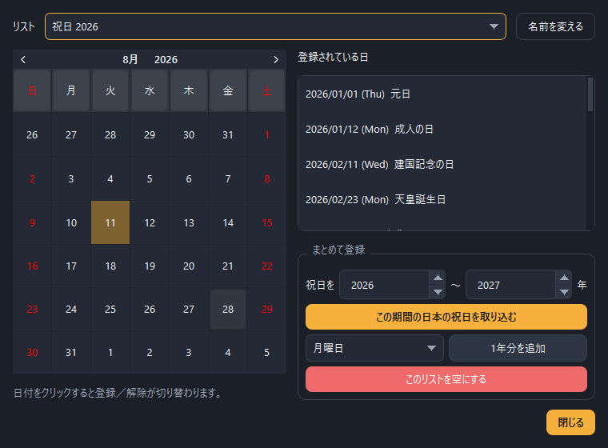

### 止め方を選ぶ

寝ぼけて止めてしまわないよう、解除の手順を 6 通りから選べます。
停止用とスヌーズ用で別々に設定でき、難易度と出題数も指定できます。

| 方法 | 中身 |
|---|---|
| ボタンを押す | 1 タップ |
| 長押しする | 秒数を指定 |
| スライドする | つまみを端まで |
| 計算問題を解く | 難易度 3 段階 × 1〜10 問 |
| 記号を順番にタップ | 4 / 6 / 8 個の記号 |
| 色と形を選ぶ | 6 択から該当のものを |

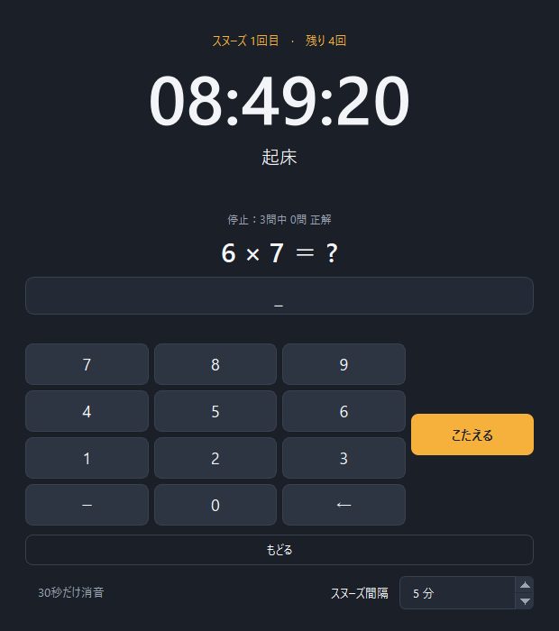

### アラームの設定

<table>
<tr>
<td width="50%">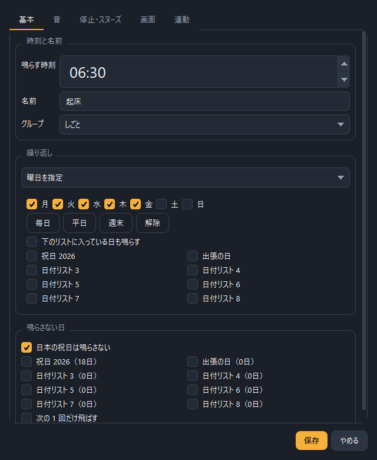</td>
<td width="50%">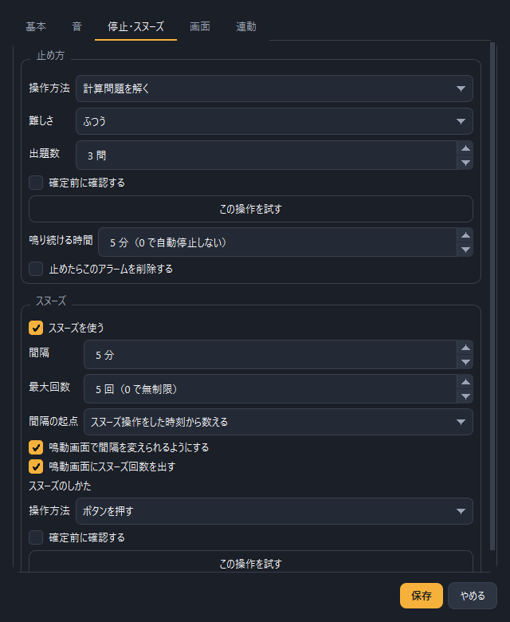</td>
</tr>
</table>

- **音** — 内蔵音 6 種 / 音声ファイル / フォルダからランダム / 無音。
  音量、フェードイン、鳴り始めの 2 秒遅延
- **スヌーズ** — 間隔、最大回数（無制限可）、間隔の起点、鳴動中の間隔変更、
  1 回目 / 2 回目 / 3 回目以降で別の音
- **一覧** — グループ 5 種（名前変更可）、検索、5 通りの並び替え、
  ON/OFF スイッチの固定、複製、まとめて設定

### PC ならではの機能

**スリープしていても起こします。**
次のアラームに合わせて Windows のスリープ解除タイマーを予約し、
鳴っている間はスリープさせません。決めた時刻に自動でスリープさせることもできます。

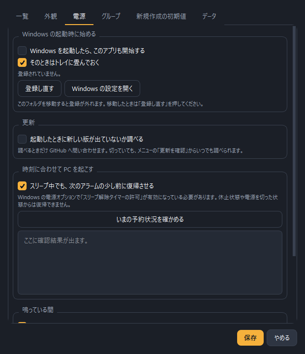

**アラームに動作を紐づけられます。**
鳴り始めたとき、または止めたときに、アプリを起動したり Web ページを開いたりします。
画像や文書を指定すれば、関連付けられたソフトで開きます。

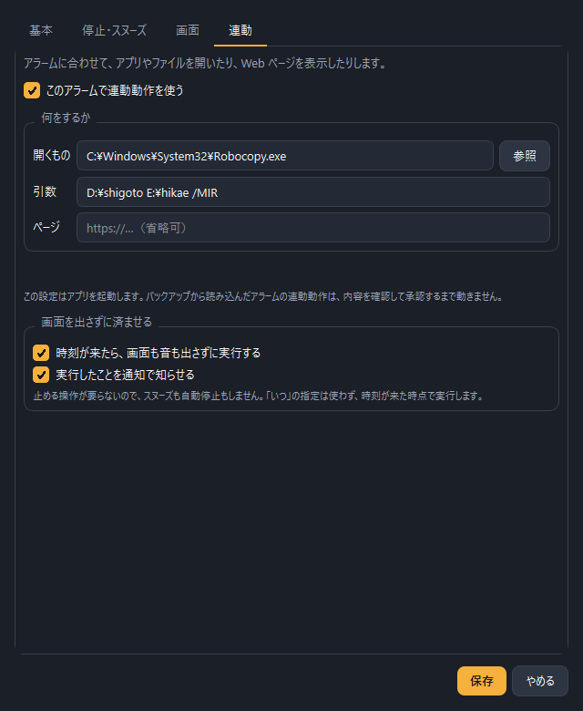

**Windows の起動と一緒に始められます。**
トレイに畳んだ状態で立ち上がるので、画面のじゃまになりません。
二重に起動しようとしたときは、すでに動いている窓が前に出ます
（同じアラームが二度鳴るのを防ぐため）。

**新しい版が出たら取り込めます。**
メニューの「更新を確認」から、その場で最新版を取り込めます。
起動時に自動で調べる設定もあります（既定は切）。

### タイマーとストップウォッチ

カウントダウンは終了日時を保持するので、**アプリを閉じても走り続けます**。
秒単位から年単位まで扱えます。

<table>
<tr>
<td width="62%">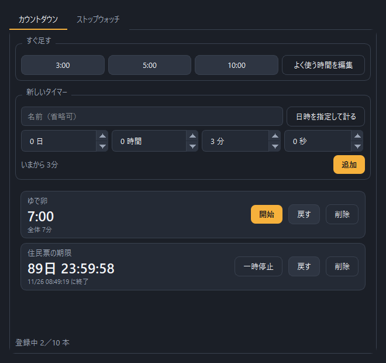</td>
<td width="38%">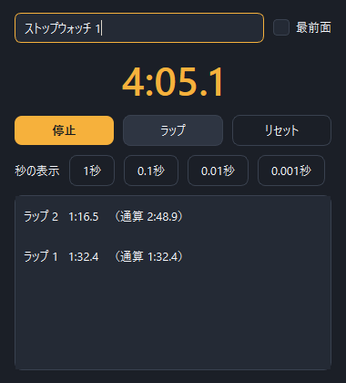</td>
</tr>
</table>

ストップウォッチは 1 台につき 1 つの窓で、何台でも同時に動かせます。
最前面固定と、秒の表示精度 4 段階つき。

### 世界時計・やることリスト

<table>
<tr>
<td width="50%">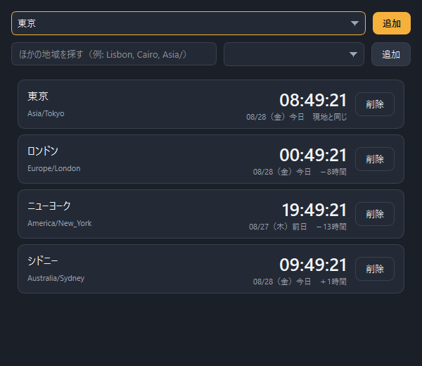</td>
<td width="50%">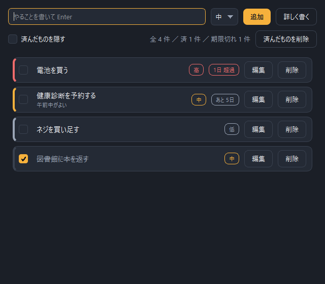</td>
</tr>
</table>

世界時計は主要 23 都市に加えて、全 IANA タイムゾーンから検索して追加できます。
やることリストは優先度 3 段階・期限・メモつきで、期限切れは色で分かります。

### 見た目とことば

配色は **下地 3 系統 × さし色 9 色 = 27 通り**。選ぶとその場で切り替わります。

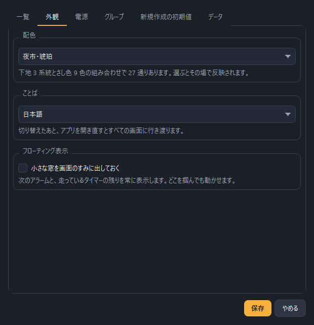

<table>
<tr>
<td width="50%">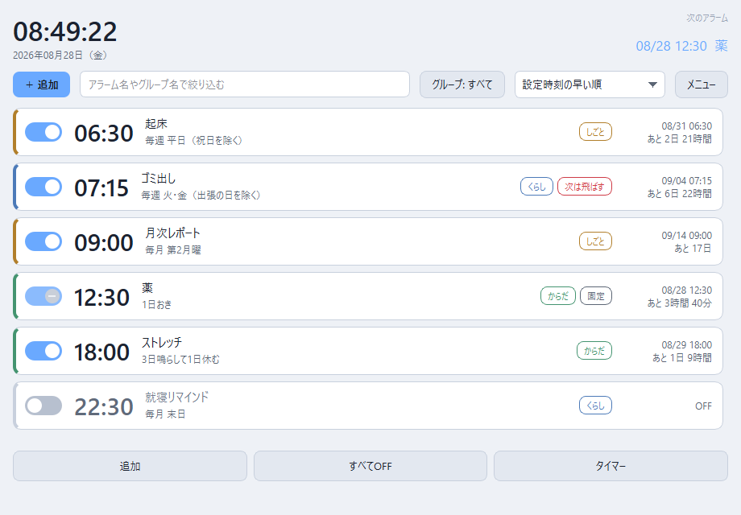</td>
<td width="50%">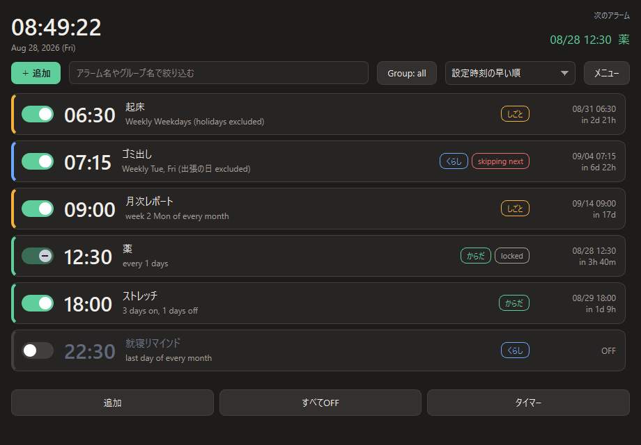</td>
</tr>
</table>

日本語と英語を切り替えられます。

### 常駐とフローティング表示

ウィンドウを閉じてもタスクトレイに残り、アラームは動き続けます。
次のアラームとタイマーの残りを、最前面の小窓に出しておくこともできます。


アプリが動いていない間に過ぎてしまった時刻は、次の起動時に知らせます。

---

## ファイル構成

```
run.pyw                   起動口（コンソールを出さない・ふだんはこちら）
run.py                    起動口（コンソール付き・不具合を追うとき）
requirements.txt
docs/screenshots/         README 用の画像
tools/
  make_shortcut.py        ショートカットを作る
  bump_version.py         版番号を進める
  check_translations.py   対訳表の抜けを調べる
koyomi/
  models.py               データ型（WakeItem, RepeatRule, SoundPlan, ...）
  planner.py              次回鳴動時刻の計算と表示用の文字列
  almanac.py              祝日判定（jpholiday）と日付リスト
  director.py             時刻の見張りとスヌーズ状態の管理
  player.py               音の再生（pygame / winsound）
  power.py                スリープ解除・スリープ抑止・自動スリープ
  autostart.py            Windows 起動時に始める登録
  updater.py              新しい版の確認と取り込み
  actions.py              アラーム連動でのアプリ起動／ページ表示
  tasks.py                やることリストのデータ
  tonesmith.py            内蔵音・アイコン・小図版の生成
  vault.py                保存と読み込み、バックアップ
  i18n.py                 ことばの切り替え
  lang_en.py              英語の対訳表
  ui/
    app.py                起動処理
    main_window.py        一覧画面
    editor.py             アラーム編集
    ring_window.py        鳴動画面
    guards.py             解除チャレンジ
    bulk.py               まとめて設定
    datelists.py          日付リスト管理
    settings.py           全体設定
    timers.py             カウントダウンタイマー
    stopwatch.py          ストップウォッチ（1 台 1 窓）
    worldclock.py         世界時計
    todo.py               やることリスト
    floatbar.py           最前面の小窓
    updates.py            更新の確認画面
    solo.py               二重起動の防止
    widgets.py            自作の小部品
    theme.py              配色とスタイルシート
    palettes.py           配色の見本帳（27 種）
```

## データの置き場所

`%APPDATA%\Koyomi\`

| ファイル | 中身 |
|---|---|
| `store.json` | アラーム、全体設定、グループ名、日付リスト、やること、世界時計 |
| `tones/*.wav` | 生成した内蔵アラーム音 |
| `glyphs/*.png` | 生成した矢印・チェックマーク |
| `appicon.png` | 生成したアプリアイコン |
| `backup/` | バックアップの既定の保存先 |

設定はすべて JSON 1 本にまとまっているので、そのままバックアップとして
書き出し／読み戻しができます。

---

## 気をつけていただきたいこと

**スリープ解除は環境に依存します。**
Windows の電源オプションで「スリープ解除タイマーの許可」が有効である必要があります。
設定画面の「いまの予約状況を確かめる」で確認できます。
休止状態と電源オフからは復帰できません（OS の仕様です）。

**連動動作は任意のプログラムを起動します。**
バックアップファイルには起動指定がそのまま含まれるため、
**外部から受け取ったバックアップを復元したときは、連動動作を無効の状態で読み込み、
内容を一覧表示して承認を求めます。** 承認しない限り実行されません。

**自動スリープは作業中でも実行されます。**
既定では無効です。アラームが鳴っている間とスヌーズ中だけは見送ります。

**フォルダを移動すると自動起動が外れます。**
登録には実行パスをそのまま書き込むためです。
移動を検知したら起動時に知らせるので、設定画面の「登録し直す」を押してください。

**更新は git の作業コピーでのみ取り込めます。**
zip で入手した場合は、配布ページを開く案内に留まります。
手元に未保存の変更があるときも、巻き込まないよう取り込みを止めます。

---

## ライセンス

[MIT License](LICENSE)

依存ライブラリはそれぞれのライセンスに従います
（PySide6: LGPLv3 / GPL、jpholiday: MIT、pygame: LGPL）。
